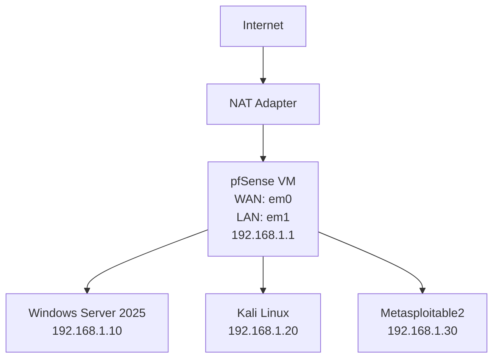

# Network Diagram

Below is a sample network diagram for your Cybersecurity Homelab, written in Mermaid syntax. You can customize this diagram to match your actual IP addresses and VM names.

## How to Customize
- Change the IP addresses to match your actual VM assignments.
- Add or remove nodes for any additional VMs (e.g., osTicket, Security Onion).
- Use diagrams.net or the Mermaid Live Editor to visualize and export your diagram.

## How to Use
- Copy the Mermaid code block above into your README or documentation.
- On GitHub, use a Mermaid plugin or screenshot for static display.
- On your website, use a Mermaid renderer for interactive diagrams. 